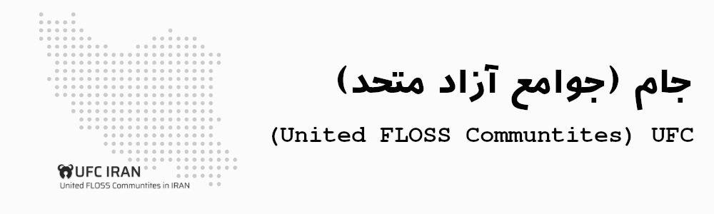

این طرح که از سوی جامعه فوسفا مطرح شده و در حال اجراست، با هدف همگام‌سازی تمام
جوامع آزاد فارسی مفید قرار است یک جو صمیمی و دوستانه میان جوامع آزاد ایران به
وجود آورد و مانع ضرر رساندن جوامع مضر به نرم‌افزار آزاد در ایران شود.

## ماده ۳ :
در سال های اخیر شاهد شکل گیری تعداد زیادی رویداد آزاد بوده ایم، به خصوص در دوران کرونا نیز رویداد های آزاد افزایش یافته است هر چند از حضوری به مجازی تغییر کرده اند اما در کل تعداد آنها افزایش یافته است... حالا با متحد شدن جوامع ما میتوانیم رویداد های بزرگتری برگزار و مدیریت کنیم.. بنابراین خوب است تمامی جوامع در اطلاع رسانی رویداد ها مشارکت داشته باشند و حداقل تلاش خود برای معرفی دگر جوامع عضو طرح را به عمل اورند.

- تبصره ۱ : به دلیل ایجاد شدن جو خوب و گسترده احتمال زیادی وجود دارد که فوسفا نیز رویداد های سراسری برگزار کند.

## ماده ۴ :
تحت هر شرایطی از هر جامعه میبایست یک نفر در هیئت مدیره حضور داشته باشد...

## ماده ۵ :
با تغییر روند مدیریتی و بهبود این جوامع این موضوع را حل کرده و در صورتی که مدیران آن جامعه در این روند مقاومت کنند و افراد اون جامعه نیز از مدیریت جامعه خود ناراضی باشند..جوامع آزاد متحد آنها را در تغییر مدیریت آن جامعه یاری مینماید، از سویی برخی از جوامع به قدری مضر هستند که قابل بهبود نیز نیستند در اینجا تصمیم بر عهده هیئت مدیره است تا با تصمیم خود راهکاری برای آن جامعه اندیشه کنند.

## ماده ۶ :
نرم افزار آزاد همواره کمترین مشکل در آمدی را به خود اختصاص میدهد به عنوان مثال بنیاد هایی نظیر KDE و Gnome در آمد خود را با کمترین مشکل کسب و هزینه های خود را پرداخت میکنند اما دلایلی باعث شده این موضوع در ایران برعکس باشد و فرهنگ دونیت جای خود را در میان فرهنگ ایرانی پیدا نکرده باشد؛ لذا یکی از اهداف جوامع آزاد متحد ایجاد سکوی پرتابی برای نرم افزار های آزاد ایرانی خواهد بود و جوامع با کمک یک دیگر به محبوب شدن نرم افزار های آزاد ایرانی سرعت میبخشند..

- تبصره ۱ : در صورت اینکه جامعه ای نیاز به کمک مالی داشته باشد توصیه میشود ابتدا موضوع را میان جوامع متحد اعلام کرده و در صورتی که جامعه ای نتوانست به آن جامعه کمک کند به صورت عمومی درخواست حمایت کند.

## ماده ۷ :
بسیار پیش آمده است شرکت/استارت‌آپ های ایرانی در حمایت از جوامع آزاد فعالیت هایی انجام داده باشند و جوامع آن حمایت ها را پس زده باشند اما طبق ماده 7 این طرح تمامی جوامع متحد میتوانند و ملزم هستند در صورتی که لطمه ای به نرم افزار آزاد و جامعه آنها وارد نمیشود از شرکت های مختلف در تامین هزینه ها/سرور یا ... استفاده به عمل اورند.

- تبصره ۱ : این ماده شامل تمام شرکت ها اعم از دولتی/خصولتی/خصوصی میشود و نباید دیدگاه این شرکت ها نسبت به نرم افزار آزاد متفاوت باشد.
- تبصره ۲ : در صورت حمایت جوامع توسط هر شرکت هیئت مدیره میباست مانع دخالت آن شرکت در مدیریت جوامع متحد و فوسفا شوند!

## ماده ۹
جدا از آرای ویژه نمایندگان پایدارگر و ارشد که در ماده ۸ توضیح داده شد، نمایندگان در صورت تمایل می‌توانند آرای معمولی‌شان که بر اساس فعالیتشان در جوامع محاسبه می‌شود را تا سقف معین افزایش دهند. امتیازدهی به فعالیت نمایندگان در دوره‌های سه ماهه (میانگین فعالیت هر ماه در دوره سه ماهه) طبق جدول زیر صورت می‌گیرد :

|                             فعالیت                             |  حد نساب نمایندگان کل | حد نساب نمایندگان جوامع | امتیاز |
|:--------------------------------------------------------------:|:---------------------:|:-----------------------:|:------:|
|                 ارائه پیشنهادی* مفید در نشست‌ها                 | یک پیشنهاد در هر دوره |          مشترک          |   ۱    |
|               تولید محتوای نوشتاری یا کمک به آن                |     ۱۰ بند در ماه     |      ۱۵ بند در ماه      |   ۳    |
|                    تولید محتوای چندرسانه‌ای                     |    ۲۰ دقیقه در ماه    |     ۴۰ دقیقه در ماه     |   ۵    |
|          ایجاد/مشارکت در پروژه آزاد (بیرون از جوامع)           |    ۱ مشارکت* در ماه   |      مشارکت* در ماه     |   ۷    |
|          ایجاد/مشارکت در پروژه آزاد یکی از جوامع عضو           |    ۱ مشارکت* در ماه   |     ۲ مشارکت* در ماه    |   ۹    |
|   پیشنهاد*/برگزاری/کمک‌به برگذاری رویداد در یکی از جوامع عضو    |  یک رویداد در هر دوره |          مشترک          |   ۱۳   |
| پیشنهاد*/برگزاری/کمک‌به برگذاری رویداد مشترک در جوامع آزاد متحد |  یک رویداد در هر دروه |          مشترک          |   ۱۸   |

پیشنهادات به شرطی موجب افزایش حق رای نماینده خواهد شد که آن پیشنهاد به تصویب برسد/آن رویداد در نهایت برگزار شود.
تولید محتوا به شرطی حساب خواهد شد که محتوای مفید باشد؛ محتوای مفید یعنی محتوایی که به آگاهی مخاطب خود می‌افزاید.
هر مشارکت در پروژه برابر اضافه کردن یک ویژگی جدید با نوشتن برنامه یا پیشنهاد ویژگی (به شرط عملی شدن آن) یا رفع اشکال یا کمک به آن (آزمایش روی دستگاه خود و ارائه اطلاعات مفید) یا ۵ گزارش ایراد است.

- تبصره ۱: در اوقات خاصی از سال که خیلی‌ها درگیر می‌شوند و فعالیت‌ها کاهش پیدا می‌کند (مانند فصل امتحانات (دی و بهمن، خرداد و تیر)) فعالیت‌ها محاسبه نمی‌شوند و از فعالیت ماه‌های دیگر میانگین گرفته خواهد شد. علاوه‌بر این اوقات، نمایندگان می‌توانند درخواست دهند تا برای مدتی (حداکثر ۴ ماه) فعالیت‌های قبلی‌شان مرجع محاسبه حق رای‌شان بماند؛ به شرط اینکه پس از به پایان رسیدن این فرصت، کمبود فعالیت‌هایشان را جبران کنند. اگر نتوانند پس از یک دوره به روند گذشته بازگردند، دوره امتیازدهی بعدی حداقل رای برایشان لحاظ خواهد شد.
- تبصره ۲: حداقل حق رای هر نماینده جامعه ۱ رای به‌ازای هر ۵۰۰ نفر از جامعه‌شان است. حداقل حق رای هر نماینده جامعه نیز برابر (مجموع آرای نمایندگان جوامع تقسیم‌بر نمایندگان کل) است.
- تبصره ۳: نهایت حق رای ممکن ۲۰٪ مجموع آراست. در صورتی که حق رای نماینده‌ای به ۲۰٪ برسد، از آن پس دیگر فعالیت‌ها به حق رای او نمی‌افزایند.
- تبصره ۴: اگر در بین دوره‌های امتیازدهی جوامعی به جوامع آزاد متحد بپیوندند یا نمایندگان علی البدلی به نمایندگی کل ارتقا یابند؛ حق رای‌شان بر اساس میانگین فعالیت‌های سه ماه قبل از عضویت/ارتقا محاسبه می‌شود؛ ولی در اولین دوره امتیازدهی حق رای‌شان بر اساس میانگین فعالیت ماه‌هایی که در جوامع آزاد متحد حضور داشته‌اند محاسبه می‌شود.

#### رای‌گیری تغییر ساختارها و قوانین
نمایندگان پایدارگر و ارشد می‌توانند تغییر ساختارها، قوانین و حتی نام‌ها و نشان‌ها را به رای بگذارند. در این رای‌گیری ویژه، باید حداقل ۶۷٪ نمایندگان (کمی بیش از ۲/۳) موافق باشند. سایر نمایندگان اگر به ساختارها، قوانین، نام‌ها و نشان‌ها اعتراض دارند، باید یکی از نمایندگان پایدارگر یا ارشد را قانع کنند تا رای‌گیری صورت گیرد.

---

### جوامع عضو و دعوت شده به طرح
  
| نام جامعه | وضعیت |
|---|---|
| لین اکادمی | ✔️ |
| لینوکس فور لایف | ✔️ |
| دیسترو‌تیوی | ✖️ ۳ |
| سوزا پرشین | ✖️ |
| ارچ پارسی | ✖️ ۲ | 
| فدورا فارسی | ✖️ ۱ |
| فری نالج | ✔️ |
| شهریار | ✔️ |
| سیلیسیوم | ✖️ |
  
*۱* جوامع زیادی با عنوان فدورا فارسی حضور دارند و هیچ کدام دارای تاییدیه رسمی از سمت فدورا نیستند.
  
*۲* مدیران ارچ پارسی زمان کافی برای شرکت در رویداد ها و.. هیئت مدیره و.. نداشته، فلذا از عضویت در طرح خودداری کردند.
  
*۳* دیسترو‌تیوی به کل منحل گشت و نابود شد.

**توجه**
  
در توییتر و ماستودون نیز اعلام شد..
  
https://mas.to/@gnkalk/107143521935448924

https://twitter.com/gnkalk/status/1451420145713303563?s=20

Copyright (c) 2021-2022 FOSSFA

شما می‌توانید این اسناد را تحت شرایط پروانه عمومی همگانی
گنو (GNU General Public License) که توسط بنیاد نرم‌افزار
آزاد (Free Software Foundation) منتشر می‌شود، یا نسخه ۳، یا (به گزینش شما) هر
نسخه بعدی بازنشر کنید و/یا تغییر دهید.

این اسناد به این امید که سودمند باشند، ولی **بدون هیچ‌گونه ضمانت** منتشر
شده اند؛ حتی بدون ضمانت ضمنی برای تجارت‌پذیری یا تناسب برای یک هدف ویژه.
برای جزئیات بیشتر پروانه عمومی همگانی گنو را ببینید.

شما باید در کنار این اسناد یک رونوشت از پروانه همگانی گنو را دریافت کرده
باشید. اگر نکرده‌اید https://www.gnu.org/licenses/ را ببینید.

